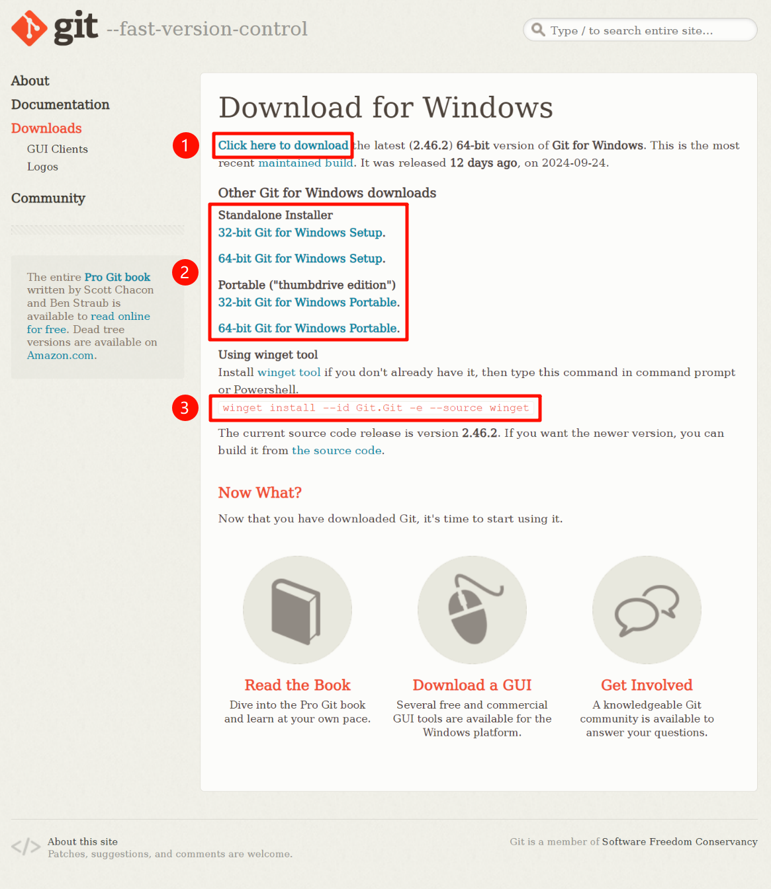

# 2 安装与配置

[TOC]

## 2.0 笔者环境

### 2.0.1 Windows

```powershell
                         ....::::       ***@***
                 ....::::::::::::       OS: Microsoft Windows 11 专业版 64 位
        ....:::: ::::::::::::::::       Kernel: 10.0.22635
....:::::::::::: ::::::::::::::::       Uptime:
:::::::::::::::: ::::::::::::::::       Motherboard: LENOVO
:::::::::::::::: ::::::::::::::::       Shell: PowerShell 5.1.22621.4005
:::::::::::::::: ::::::::::::::::       Resolution: 2560 x 1600
:::::::::::::::: ::::::::::::::::       Window Manager: DWM
................ ................       Font: Segoe UI
:::::::::::::::: ::::::::::::::::       CPU: 13th Gen Intel(R) Core(TM) i5
:::::::::::::::: ::::::::::::::::       GPU Parsec Virtual Display Adapter
:::::::::::::::: ::::::::::::::::       RAM:
'''':::::::::::: ::::::::::::::::       Disk C:
                         ''''::::
```

### 2.0.2 WSL

```bash
            .-/+oossssoo+/-.               [hidden]@[hidden]
        `:+ssssssssssssssssss+:`           ---------------
      -+ssssssssssssssssssyyssss+-         OS: Ubuntu 22.04.5 LTS on Windows 10 x86_64
    .ossssssssssssssssssdMMMNysssso.       Kernel: 5.15.153.1-microsoft-standard-WSL2
   /ssssssssssshdmmNNmmyNMMMMhssssss/      Uptime: secs
  +ssssssssshmydMMMMMMMNddddyssssssss+     Packages: 675 (dpkg)
 /sssssssshNMMMyhhyyyyhmNMMMNhssssssss/    Shell: bash 5.1.16
.ssssssssdMMMNhsssssssssshNMMMdssssssss.   Theme: Adwaita [GTK3]
+sssshhhyNMMNyssssssssssssyNMMMysssssss+   Icons: Adwaita [GTK3]
ossyNMMMNyMMhsssssssssssssshmmmhssssssso   Terminal: Relay(294)
ossyNMMMNyMMhsssssssssssssshmmmhssssssso   CPU: Intel i5 (16) @ 3.187GHz
+sssshhhyNMMNyssssssssssssyNMMMysssssss+   GPU: Microsoft Corporation Device
.ssssssssdMMMNhsssssssssshNMMMdssssssss.   Memory:
 /sssssssshNMMMyhhyyyyhdNMMMNhssssssss/
  +sssssssssdmydMMMMMMMMddddyssssssss+
   /ssssssssssshdmNNNNmyNMMMMhssssss/
    .ossssssssssssssssssdMMMNysssso.
      -+sssssssssssssssssyyyssss+-
        `:+ssssssssssssssssss+:`
            .-/+oossssoo+/-.
```

## 2.1 安装 Git

### 2.1.1 Windows



对于 Windows 用户，如果还没有在您的个人电脑上安装 Git，请访问 [Git 官方网站](https://git-scm.com/downloads/win) 下载 Windows 安装包。如上图所示，官方提供了三种下载方式。

对于绝大多数用户，请选择第一种下载方式——**Click here to download**。但如果您的电脑是 32 位 Windows，或者您只是想要体验而非在电脑上安装 Git，请选择第二种下载方式，以下是详细说明：

+ **Standalone Installer**：即独立安装包，这意味着您将会在您的个人电脑上安装 Git。如果您的 Windows 是 32 位[^1]，请选择 **32-bit Git for Windows Setup**；同理，对于 64 位 Windows[^1]，请选择 **64-bit Git for Windows Setup**。
+ **Portable**：即便携版，这意味着您无需安装即可使用 Git，适合于需要便携 Git 环境或者只想要体验而非安装 Git 的用户，您可以将 Git 放在 U 盘或其他移动存储设备上。关于位数的选择，请参照 **Standalone Installer** 的说明。

如果您使用 `winget`，请在命令提示符 CMD 或 PowerShell 中执行以下命令：

```cmd
winget install --id Git.Git -e --source winget
```

下载后，双击安装程序，例如 `Git-2.46.2-64-bit.exe`，然后一直点击 <kbd>Next</kbd> 就能完成安装。

安装完成后，在命令提示符 CMD 或 PowerShell 中执行以下命令：

```cmd
git --version
```

如果得到类似以下输出，则证明 Git 安装成功：

```cmd
git version 2.46.2.windows.1
```

[^1]: 如果您不知道您的电脑是多少位的，请参考 [32 位和 64 位 Windows：常见问题解答](https://support.microsoft.com/zh-cn/windows/32-%E4%BD%8D%E5%92%8C-64-%E4%BD%8D-windows-%E5%B8%B8%E8%A7%81%E9%97%AE%E9%A2%98%E8%A7%A3%E7%AD%94-c6ca9541-8dce-4d48-0415-94a3faa2e13d)

### 2.1.2 Ubuntu/Debian

对于 Ubuntu 或 Debian 用户，使用以下命令安装 Git：

```bash
sudo apt update
sudo apt install git
```

安装完成后，在 Bash 或其他 Shell 中执行以下命令：

```shell
git --version
```

如果得到类似以下输出，则证明 Git 安装成功：

```shell
git version 2.34.1
```

### 2.1.3 其他操作系统

对于使用其他操作系统的用户，请访问 [Git 官方网站](https://git-scm.com/) 获取更多帮助。

## 2.2 基本配置

安装完成后，需要对 Git 进行一些基本的配置，以便它能正常工作。这些配置主要包括设置用户名和邮箱，这些信息会记录在每一次提交（commit）中。

> [!note]
>
> 注意，本教程从此处开始，使用 Shell 代指所有命令行环境，包括 Windows 的 CMD 和 PowerShell，Linux 的 Bash 和 Zsh 等。

在 Shell 中执行以下命令来配置全局用户名和邮箱：

```shell
git config --global user.name "your_username"
git config --global user.email "your_email"
```

设置完成后，在 Shell 中执行以下命令来查看配置是否成功：

```shell
git config --global --list
```

您可以得到类似以下输出：

```shell
user.name=your_username
user.email=your_email
```

请仔细检查您配置的全局用户名和邮箱是否正确，如果您的配置出现错误，请使用上述命令重新配置。如果您想要取消全局配置，请使用以下命令：

```shell
git config --global --unset user.name
git config --global --unset user.email
```

> [!note]
>
> 细心的您可能已经发现，笔者这里的用词是 “全局”，那么与之相反，是否可以配置 ”局部“ 用户名和邮箱？
>
> 实际上，Git 确实可以配置 “局部” 用户名和邮箱，不过这并不常用，因为局部配置仅在特定的仓库中有效，而全局配置适用于所有仓库。
>
> 与之相关的更多讨论将在后序章节中进行。
